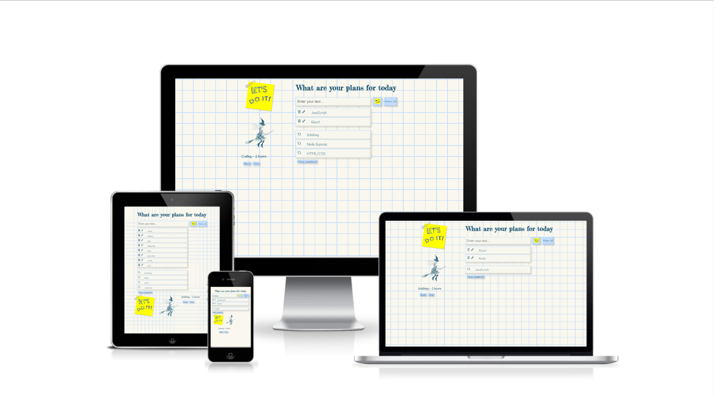

<h1><em><a href="https://todo-react-m.netlify.app" target="_blank">To-Do react app</a><em></h1>
    

  <h3>Features:</h3>
    <ul>
      <li>User-friendly</li>
      <li>Local Storage Supported</li>
      <li>Responsive, on all devices</li>
      <li>Add/Edit/Delete/Delete All/Return/Clean Completed - todos</li>
   </ul>

  <h3>Technologies Used</h3>
   <ul>
      <li><a href="https://reactjs.org/" target="_blank">React</a></li>
      <li><a href="https://www.w3schools.com/js/" target="_blank">JavaScript</a></li>
   </ul>

  <h3>Website Demo</h3>

https://user-images.githubusercontent.com/95896159/208996122-b52f112a-51c2-4d88-bbc1-ad73dca0758c.mp4

